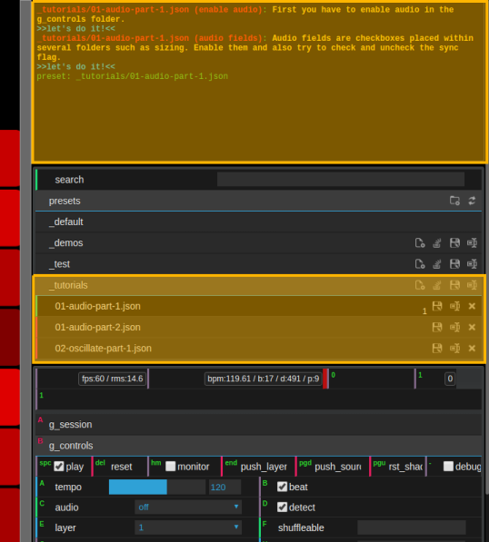

# indivisual - VJ-Synthesizer

## What is it?
YEAH BABY!!! 

indivisual - VJ-Synthesizer is a rhythm based animation tool giving you the ability to have shapes dancing and flickering to the music.
The most settings can be "oscillated" so that different variations on how a shape is moved, rotatet, transformed, modified, colored, 
lit, sized, postprocessed, ... can be mixed in.  
There also is a mechanism to record samples and then mix them in sequences with different composite operations. 
Those sequences can be flipped, sliced, accelerated, slowed down, ... and also cans be used as shape material.

To get an idea of what can be done with it, visit my [YouTube channel](https://www.youtube.com/channel/UC2QczAUG69575hFIRg2JDcQ)  


## Getting Started
- To get the best performance you should install [Google Chrome](https://www.google.com/chrome/) 
- Install [Node.js](https://nodejs.org/en/download/)
- Install [yarn](https://yarnpkg.com/lang/en/docs/install) 
- On debian (ubuntu/mint/...) you can install Node.js and yarn by executing:
  ```
  sh ./debian-installer.sh
  ```

- After installing yarn you might have to restart the command line/terminal window. 
- Execute the following lines in your command line within the installation directory:
    ```
    $ yarn install
    $ yarn start
    ```
- To use as single page application open http://localhost:8081
    - Learn how to use in seperated windows or even multiple machines [here](docs/setup-options.md)
- Scroll down to the Tutorials section and have a look
    

## For Developers
There is no clean code in there. There also is no explicit design pattern 
except a plugin concept designed by myself.

However i tried to cleanup and remove the messiest parts of it since i retired 
from my part time job as a VJ performing video life acts in some well known clubs in Munich.
I also retired from being a professional developer due to my inability 
to use popular programming techniques and design patterns.  

Therefore things do not work together perfectly sometimes.

But still it's pretty much fun to play with!


### Deprecated Powerful Features on Insecure (non SSL) Origins
When not running on localhost, it is not possible to use microphone or audio input without SSL.
- You can either run chrome with the --unsafely-treat-insecure-origin-as-secure="http://example.com" flag (replacing "example.com" with the origin you actually want to test)
    like described in this [article](https://sites.google.com/a/chromium.org/dev/Home/chromium-security/deprecating-powerful-features-on-insecure-origins)
- Or you have to enable SSL

Server options can be found [here](docs/server-options.md)


## How To

### Tutorials
- Getting started
- [Displays, Video, Mapping & Masking](docs/mapping.md)
- Source, Sequences & Samples
- Audio, Timing & Osci
- Lighting & Background
- Camera & Layer
- Pattern
- Shape & Material
- Coloring & Filter
- Rotation & Locking
- Sizing & Offset
- Shaders (Postprocessing)

Have a look at my [Tutorials playlist](https://www.youtube.com/playlist?list=PLQn3ZXgzn8P3BI43-pDmU4rVFzVmQh5DQ)

Try the tutorials from presets/_tutorials 




### Understand
- A lot of settings are based on three.js settings. To understand these, you have to dig into three.js [docs](https://threejs.org/docs/index.html#manual/en/introduction/Creating-a-scene)  


### Samples & Sequences
- ... awesome ...
- Slow on GPUs but fast on INTEL's internal graphics cards


### Shape-Editor
- ... more explanation here ...

- In the controller, set shape_geometry to custom
- Open http://localhost:8081/setup.html
- Press S to enable shape controls
- ... more explanation here ...


### MIDI Controllers
- If you own a [Arturia Beatstep](https://www.arturia.com/beatstep/overview), simply connect it. If the device uses factory settings, it will work immediately and the layout will just work fine.
- Otherwise you have to build up your own layout. Have a look at [MidiController.yml](app/structure/MidiController.yml) 
- ... more explanation here ...  


### Plugins
indivisual comes with a set of funny plugins. Nevertheless you might want to extend it with some of your own ideas.
In this case you can add your own plugins for the most settings available.

To find out more read plugins [tutorial](docs/plugins.md).


## Questions & Answers
- Create an issue for your question


## Contributing
If you have any suggestion or features or you found some bugs,
feel free to contribute to this project.
Just open a pull request or an issue.


## Used Libraries and Credits
Many thanks to:

- Google for their lightning fast browser/engine
- All the people contributing to web browser technology
- https://github.com/mrdoob/three.js
- https://github.com/tweenjs/tween.js
- https://github.com/glowbox/maptasticjs
- https://github.com/vuejs/vue
- https://github.com/dataarts/dat.gui
- https://github.com/mrdoob/stats.js
- https://github.com/chandlerprall/ThreeCSG
- https://github.com/nodejs/node
- https://github.com/yarnpkg/yarn
- https://www.shadertoy.com/
- https://uberviz.io/viz/word-problems/